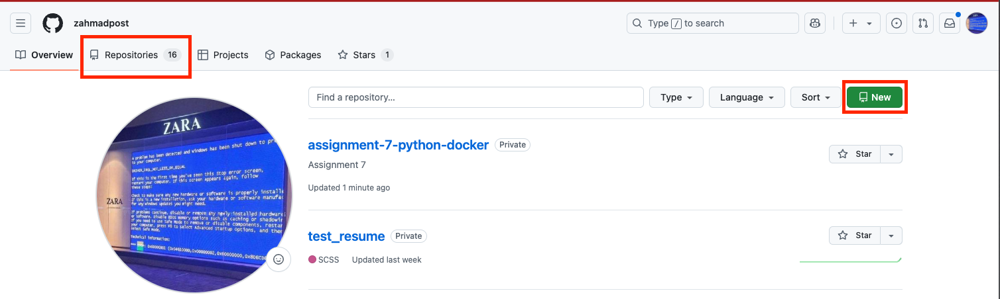

# Part 1: Containerize a Flask Application

In Part 1, we’re going to use `docker init` to containerize a simple Flask application. `docker init` is a recent (May 2023) utility that helps us containerize our projects by providing a interactive wizard that lets us specify our container requiremetns.
If you have an older version of Docker Desktop installed, please update your Docker Desktop to a version greater than 4.19.
Much of Part 1 will feel familiar, but there are some changes and a few more details included to build on our existing Docker knowledge.
We’ll be using a sample Flask application for this lab. First, you'll clone the repo where the starter code lives, create an image, test our image, then update the remote git URL to a repository in your own GitHub profile and push the code to your repo.  
## Part 1: Set up your project

First, create a new local directory where you want your Flask project to live: \
Open a terminal, change directory (`cd`) to the location where you’d like to create your Flask project and make a new directory called **lab-5** (or anything else you'd like to call it). Now cd into **lab-5** and clone the remote repository:

```bash
git clone https://github.com/docker/python-docker
```
This will clone **python-docker** into your **lab-5** directory. `cd` into the newly created **python-docker** directory. 
Before moving forward, update the git remote URL so that you can push any code changes to your own repository.

We'll remove the existing git configurations:
```bash
rm -rf .git
```

## Part 2: Test the application locally

Let’s test the application locally without Docker. In your terminal, navigate to the working directory you created when you cloned the repository (it should be called `python-docker`). 

We’ll create a virtual environment, install the dependencies we need to run the application, and start the application to make sure it’s running:

1. If you haven't already, `cd` into the working directory
    
    ```bash
    cd <path/to/python-docker>
    ```
    
2. Create a uv environment 
    
    ```bash
    uv init
    ```
    
3. If your environment doesn't automatically activate, you can activate it using environment
    
    ```bash
    source python-docker/env/bin/activate
    ```
        
4. Install the requirements
    
    ```bash
    uv pip install -r requirements.txt
    ```
    
5. Run your flask server
    
    ```bash
    python3 -m flask run
    ```
    You'll receive a warning message that this is a development server and should not be used in production. 

6. Test that the application is working by opening a browser and navigating to: [http://127.0.0.1:5000](http://127.0.0.1:5000/) You should see a blank webpage with the text:
    ```text
    Hello, Docker!
    ```
    in the top left corner. 

7. Switch back to the terminal where the server is running and you should see the following request in the server logs:
    
    ```bash
    127.0.0.1 - - DATE  “GET / HTTP/1.1” 200 -
    ```
    
8. Press `CTRL+C` to quit the server.

## Part 3: Create a Dockerfile for Python

We have our Flask application running locally! We’re now going to use `docker init` to create a `Dockerfile` for it.

1. Back in your terminal or command prompt, enter `CTRL+C` to quit out of the server. Then, in the python-docker directory, run the `docker init` command.
    
    ```bash
    docker init
    ```
    
    Docker init is a utility that helps you create the requisite files for your Docker image.
    
    Running `docker init` will give you some prompts to answer. Fill them in as seen below (run `python --version` to get the version of python to enter in the second question) When selecting from a list of options, you can use the arrow keys to navigate up or down, then hit `Enter` to select.
    
    <aside>
    
    ? What application platform does your project use? **Python**
    
    ? What version of Python do you want to use? **3.xx.x** <version of python you’re using or hit `Enter` to accept the default version listed>
    
    ? What port do you want your app to listen on? **5000**
    
    ? What is the command to run your app? **python3 -m flask run --host=0.0.0.0**
    
    </aside>
    
    You should now have 3 new files in your python-docker directory:
    
    - Dockerfile
    - .dockerignore
    - compose.yaml

The Dockerfile contains the instructions build your image. The `.dockerignore` file specifies patterns and paths that you don’t want copied into the image. Inspect the `.dockerignore` file to see what should be excluded for a python container.

## 3a: Update our Dockerfile to use dumb-init

We're going to update our Dockerfile to use a very popular tool called `dumb-init`. dumb-init ensures that the processes we're running inside our container are not using `PID1`. Without this step, when we're running our application in a Kubernetes pod, we would have to kill the entire container, instead of just quitting our server inside the container. See more information about `dumb-init` [here](https://github.com/Yelp/dumb-init). 

Let's make a few changes to the existing `Dockerfile` to use `dumb-init`: 
1. Add the following after `ENV PYTHONBUFFERED=1` and before `WORKDIR /app`:
    ```
    #Install dumb-init
    RUN pip install dumb-init
    ```
2. Add the following `ENTRYPOINT` after `EXPOSE 5000` and before the `CMD` line:
    ```
    # Add an entrypoint script to run the application.
    ENTRYPOINT ["/usr/local/bin/dumb-init", "--"]
    ```
    This tells our container to use `dumb-init` before we run our `CMD`

3. Update our `CMD` instruction to use **exec** form instead of **shell** form. (We have used both forms in the past, and either one is valid! Let's use **exec** form now so that we can use our `ENTRYPOINT`.) Copy the line below and paste it over the existing `CMD` instruction.
    ```
    # Run the application.
    CMD ["python3", "-m", "flask", "run", "--host","0.0.0.0"]
    ```

## Part 4: Build an Image

Now that we've created our `Dockerfile`, we can build an image. We’ll use the `docker build` command. This will build a Docker image from a Dockerfile and a **build context.** A build context is the set of files that the build has access to (e.g, our working directory.)

The build command optionally takes a `--tag` flag. This will set the name of the image and an optional tag in the format `name:tag`. The default tag will be `“latest”`. Each organization and environment will have its own conventions for tags.

1. Build the Docker image (note the period at the end of the line!!)
    
    ```bash
    docker build --tag python-docker .
    ```
    
    We now have a local Python image built! We can see a list of images on our local machine either through Docker Desktop, or through the Docker CLI. 
    
2. Run `docker images` to see the list of images that are available on your machine.
    
    ```bash
    docker images
    ```
    
    You should see at least one image listed, including the image we just built (python-docker:latest)
    
    The docker `tag` command creates a new tag for an image. It doesn’t create a new image. The tag points to the same image and is another way to reference the image.
    
3. Run the following command:
    
    ```bash
    docker tag python-docker:latest python-docker:v1.0.0
    ```
    
4. Run `docker images` command again to see a list of the local images. Inspect both the TAG and IMAGE ID columns. What do you notice?
5. We can remove the tag we created using the `rmi` command. Run:
    
    ```bash
    docker rmi python-docker:v1.0.0
    ```
    
6. Run the docker images command again to see the image removed from your list of local images.
    
    ```bash
    docker images
    ```
    

## Part 5: Run your image as a container

Now that we have an image, we instantiate the image as a  container and make sure that it’s working correctly. A container is a normal operating system process except that this process is isolated in that it has its own filesystem, its own networking, and its own isolated process tree separate from the host.

1. To run an image inside of a container, use the `docker run` command and pass the name of the image we want to run:
    
    ```bash
    docker run --rm python-docker
    ```
    
2. Once we run this command, the current terminal will not return us to a command prompt. This is because this application is a REST server and will run in a loop waiting for incoming requests without returning control back to the OS until you stop the container. Open a new terminal, and make a `GET` request to the server using the curl command:
    
    ```bash
    curl localhost:5000
    ```
    Our `curl` command didn't return any information!? Switch to the terminal where our server is running. Notice that we don't see any requests served, even though we curled localhost:5000. Why might that be?
    
3. `curl` failed because the connection to the server was refused (we weren’t able to connect to localhost on port 5000.) This is because your container is running in isolation, which includes networking. Let’s fix this so that we can make a `GET` request to our server.
4. First, let’s stop the container. In the command prompt or terminal window that is running our server, press `CTRL+C`. This will return us to the command prompt. (If you are having trouble stopping the flask server, in a new terminal, run: `docker ps` to get a list of all running containers. Copy the container ID of the flask server container, and then pass it to the command: `docker stop your_container_id_here`.)
5. We need to publish a port for our container. We can use the `--publish` flag (`-p` for short) when invoking the docker run command. The format is `--publish [host port]:[container port]`. So if we want to expose port `5000` inside the container to port `3000` outside the container, we would pass `3000:5000` to the `--publish` flag. 
    
    Let’s map the host’s port 8000 to the container port 5000:
    
    ```bash
    docker run --publish 8000:5000 python-docker
    ```

6. Now, let’s open a new terminal window and re-run the curl command.
    
    ```bash
    curl localhost:8000
    ```
    
7. Now you can connect to the application running inside of your container on port `8000`. If you navigate back to the first terminal window, you should see your `GET` request logged to the console.
8. Press ctrl+c to stop the container.

## Part 6: Running in Detached Mode

1. If we run our container in detached mode, then our server will run in the background and return us to our terminal prompt. Run the following:
    
    ```bash
    docker run -d -p 8000:5000 python-docker
    ```
    
    Docker will print the container ID on the terminal. 
    
2. Now let’s make sure our container is running properly. Run the following:
    
    ```bash
    curl localhost:8000
    ```
    
3. Since our container ran in the background, how do we know if it’s running, or what other containers are running? We can run `docker ps` to see a list of containers that are running:
    
    ```bash
    docker ps
    ```
    
    This lets us see the container IDs, the image running inside the container, the command used to start the container, when it was created, the status, ports that were exposed, and the name of the container.
    
4. We didn’t give the container a name when we created it, so Docker automatically generated a random name for us. Let’s give our container a name. First, run `docker stop`. Then pass the name of the container:
    
    ```bash
    docker stop container_name
    ```
    
    Now rerun the docker ps command to see a list of running containers:
    
    ```bash
    docker ps
    ```
    
    When you stop a container, it is not removed, but the status is changed to stopped and the process inside the container is stopped. Running `docker ps` only show running containers. When you pass `--all` or `-a` you can see all containers on your machine, whether or not they are stopped.
    
    ```bash
    docker ps -a
    ```
    
5. Restart the container we stopped:
    
    ```bash
    docker restart container_name
    ```
    
    Now run:
    
    ```bash
    docker ps --all
    ```
    
    Our container has been restarted in detached mode and has port 8000 exposed.
    
6. Now stop and remove all of your containers and take a look at fixing the random naming. Stop the container:
    
    ```bash
    docker stop container_name
    ```
    
    To remove a container, run the docker rm command with the container name.
    
    ```bash
    docker rm container_name
    ```
    
7. Now run `docker ps --all` command again to see that the container is removed.
8. Let’s name our container. We’ll pass the `--name` flag to `docker run`:
    
    ```bash
    docker run -d -p 8000:5000 --name flask-server python-docker
    ```
    
    Run `docker ps` to see the properly named container running.
    
9. Stop your container by running:
    
    ```bash
    docker stop rest-server
    ```

## Part 7: Commit your code to your GitHub repository.

Let's get ready to commit our code to a new repository. First, let's add a `.gitignore` file so that we don't commit virtual environment files, or local python cache files.

1. In your `python-docker` working directory, create a `.gitignore` file. Add the following contents to `.gitignore`:
    ```
    __pycache__
    python-docker-env
    README.Docker.md
    ```
2. Next, go to your profile in GitHub. Click on the 'Repositories' tab, and create a new repository called `lab-5-python-docker` (or something similar). 


Please make the repository public. Don't initialize the repository with a README file. 


3. Once the repository is created, initalize git in your project directory, add the remote URL to your local git repository and push the local files. You can get the remote URL from the repository set up screen:


    ```bash
    git init
    git remote add origin <URL for your repository>
    git branch -M main
    ```
4. Now add your files and write a commit message:

    ```bash
    git add .
    git commit -m "<commit message here>"
    git push origin main
    ```

[See documentation here if you’re having trouble.](https://github.com/git-guides/git-init)