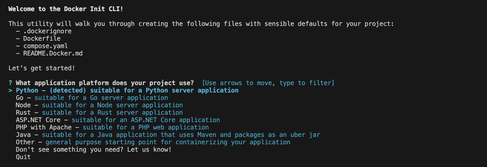

# Part 2: Add a Database to Our Flask Application

In Part 2, we’ll go into some more depth to containerize an application. We’ll work through containerizing an application that requires a database. Docker offers images for many kinds of databases. This makes it much easier to manage our databases in various environments (rather than downloading PostgreSQL, installing, configuring, and then running the database on your system directly, we’ll use the Docker image and run it in a container.)

In this part, we’ll be using a sample application that uses FastAPI. Learn more about [FastAPI here](https://fastapi.tiangolo.com/)!

# Step 1: Clone the Sample Repository.

Change to a directory where you want to clone the repository and run the following command.

```bash
git clone https://github.com/estebanx64/python-docker-dev-example
```

`cd` into `python-docker-dev-example`. Delete the `.git` directory using `rm -rf .git`. 

We're not going to test running this application locally outside of a container, rather, we're just going to move forward with creating and building an image and running a container from it. 

In the cloned repository’s directory, run `docker init` to create the necessary Docker assets. 



When prompted, use the following examples:

<aside>

? What application platform does your project use? Python

? What version of Python do you want to use? 3.11.4 ****

? What port do you want your app to listen on? 8001

? What is the command to run your app? python3 -m uvicorn app:app --host=0.0.0.0 --port=8001

</aside>

# Step 2: Add a local database and persist data

In order to run a database, we will need to create two things: a database container and a **`volume`** that Docker can manage to store persistent data and configuration. 

We’ll create these resources by using Docker compose. In your project directory, open the `compose.yaml` file that was created after we ran `docker init` . Although `docker init` handled most of what we needed to create, we still need to update it for our application.

First, uncomment all of the database instructions. We’ll also add a database password file as an environment variable and specify the secret file to use. See below for what the final `compose.yaml` file should look like. 

<aside>

```docker
*# Here the instructions define your application as a service called "server".*
*# This service is built from the Dockerfile in the current directory.*
*# You can add other services your application may depend on here, such as a*
*# database or a cache. For examples, see the Awesome Compose repository:*
*# https://github.com/docker/awesome-compose*
services:
  server:
    build:
      context: .
    ports:
      - 8001:8001
    environment:
      - POSTGRES_SERVER=db
      - POSTGRES_USER=postgres
      - POSTGRES_DB=example
      - POSTGRES_PASSWORD_FILE=/run/secrets/db-password
    depends_on:
      db:
        condition: service_healthy
    secrets:
      - db-password
  db:
    image: postgres
    restart: always
    user: postgres
    secrets:
      - db-password
    volumes:
      - db-data:/var/lib/postgresql/data
    environment:
      - POSTGRES_DB=example
      - POSTGRES_PASSWORD_FILE=/run/secrets/db-password
    expose:
      - 5432
    healthcheck:
      test: ["CMD", "pg_isready"]
      interval: 10s
      timeout: 5s
      retries: 5
volumes:
  db-data:
secrets:
  db-password:
    file: db/password.txt
```

</aside>

**Note the following new fields:**

- `depends_on` tells Docker Compose to start the database before your application. This is a super power for Docker Compose- you're able to define dependecies and start orders using Compose, which is going to make each subsequent run of this application so much more straight forward.
- `db-data` volume persists the database data between container restarts. 
- `secrets` is a special compose field that lets us define where any requisite secrets can be found so that our application can run. 
- Notice also that the last line of the `compose.yaml` file includes a path to a file `db/password.txt`. We have to create that because it’s not present in the source repository. We have to create this before running `docker compose up`.
- Notice that the `compose.yaml` file doesn’t specify a network for these 2 services. Compose will automatically create a network and connect the services to it. Yet another Docker Compose superpower.

In our cloned repository directory, create a new directory named `db`, and inside that directory create a file named `password.txt` that contains the password for the database. Use your IDE (VSCode) or text editor and add the following contents to the password.txt file:

```
mysecretpassword
```

Your python-docker-dev directory should now have this structure:

```markdown
|- python-docker-dev-example/
|   |- db/
|   |  |- password.txt
|   |- app.py
|   |- requirements.txt
|   |- .dockerignore
|   |- compose.yaml
|   |- Dockerfile
|   |- README.md
```

From the root of your project (i.e. `python-docker-dev-example/`) run the following `docker compose up` command to start your application:

```
docker compose up --build
```

Passing `--build` flag will compile your image and then start the containers.

First, the database container will start, and then the Uvicorn container will start. Wait until you receive the message, “Uvicorn running on http://0.0.0.0:8801” and then continue.

Let’s test our API endpoint. Open a new terminal and make a request to the server using the curl commands:

We’ll create an object with a POST method:

```markdown
 curl -X 'POST' \
  'http://0.0.0.0:8001/heroes/' \
  -H 'accept: application/json' \
  -H 'Content-Type: application/json' \
  -d '{
  "id": 1,
  "name": "my hero",
  "secret_name": "austing",
  "age": 12
}'
```

You will receive the following response:

```
{
  "age": 12,
  "id": 1,
  "name": "my hero",
  "secret_name": "austing"
}
```

Now we’ll make a GET request using curl:

```markdown
curl -X 'GET' \
  'http://0.0.0.0:8001/heroes/' \
  -H 'accept: application/json'
```

We should receive the same response we did when we made our POST request, because we’ve only added one object in our database.

Press `CTRL+C` to stop the application. 

# Step 3: Automatically Update Services

We’re going to use a tool called Compose Watch to automatically update our running Compose services while we edit and save our code. 

Open your `compose.yaml` file in your IDE, and add the Compose Watch instructions below: 

 

```markdown
services:
  server:
    build:
      context: .
    ports:
      - 8001:8001
    environment:
      - POSTGRES_SERVER=db
      - POSTGRES_USER=postgres
      - POSTGRES_DB=example
      - POSTGRES_PASSWORD_FILE=/run/secrets/db-password
    depends_on:
      db:
        condition: service_healthy
    secrets:
      - db-password
    develop:
      watch:
        - action: rebuild
          path: .
  db:
    image: postgres
    restart: always
    user: postgres
    secrets:
      - db-password
    volumes:
      - db-data:/var/lib/postgresql/data
    environment:
      - POSTGRES_DB=example
      - POSTGRES_PASSWORD_FILE=/run/secrets/db-password
    expose:
      - 5432
    healthcheck:
      test: ["CMD", "pg_isready"]
      interval: 10s
      timeout: 5s
      retries: 5
volumes:
  db-data:
secrets:
  db-password:
    file: db/password.txt
```

Run the following command to run our application with Compose Watch:

```markdown
docker compose watch
```

Now let’s curl the application:

```markdown
curl http://localhost:8001
```

You should receive a response saying “Hello, Docker!” 

If we change our application’s source files locally, they will now be immediately reflected in the running container. 

Open `python-docker-dev-example/app.py` in your IDE and update the “Hello, Docker!” string to say “Hello, <Your Name Here>!” 

Save the changes to `app.py` and then wait for a moment for the application to rebuild. Now curl the application again and verify that the update text appears:

```markdown
curl http://localhost:8001
```

Run: 

```
docker compose down
```

to shut down your running containers.

# Step 4: Commit Your Code to GitHub

1. In your project directory, add a .gitignore file and add the following content: 
    
    ```
    # Byte-compiled / optimized / DLL files
    __pycache__/
    *.py[cod]
    *$py.class
    
    # C extensions
    *.so
    
    # Distribution / packaging
    .Python
    build/
    develop-eggs/
    dist/
    downloads/
    eggs/
    .eggs/
    lib/
    lib64/
    parts/
    sdist/
    var/
    wheels/
    share/python-wheels/
    *.egg-info/
    .installed.cfg
    *.egg
    MANIFEST
    
    # Unit test / coverage reports
    htmlcov/
    .tox/
    .nox/
    .coverage
    .coverage.*
    .cache
    nosetests.xml
    coverage.xml
    *.cover
    *.py,cover
    .hypothesis/
    .pytest_cache/
    cover/
    
    # PEP 582; used by e.g. github.com/David-OConnor/pyflow and github.com/pdm-project/pdm
    __pypackages__/
    
    # Environments
    .env
    .venv
    env/
    venv/
    ENV/
    env.bak/
    venv.bak/
    ```
    
2. In your GitHub profile, create a new repository, called `lab-5-part-2`. *This repository name needs to be lowercase so that we can use it in Part 3*. 
3. Initialize your local project as a git repository, add the remote URL, add and commit, and then push your files to your new repository. If you need help, refer to Lab 5, Part 1.