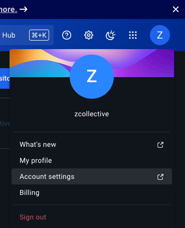
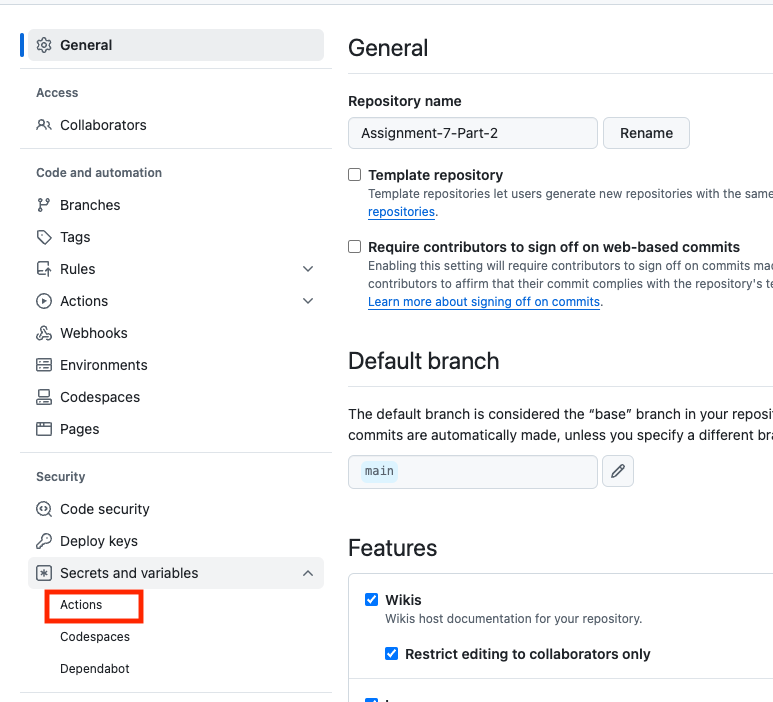

# Part 3: Configure CI/CD using GitHub Actions for your Python Application

In Part 3, we’re going to set up our Lab 5 Part 2 Repository to run a GitHub Actions (GHA) workflow. Our GHA workflow will login to DockerHub, build your container image, and push the image to your DockerHub account.

**Prerequisites:**

- In Lab 0, we created a Docker Hub account. Sign into your account (or go to [https://hub.docker.com/signup](https://hub.docker.com/signup) and create a Docker Hub account if you don’t already have one.) Complete the steps to verify your email address.
- In Lab 5, Part 2, we created a GitHub repository and pushed our code to it. If you haven’t completed Part 2, please do that now and then proceed.

# Step 1: Add Secrets in GitHub

1. Log in to [Docker Hub](https://hub.docker.com/).
2. Create a new Personal Access Token (PAT) for Docker Hub:
    - Select your avatar in the top-right corner and from the drop-down menu select **Account settings.**
        
        
        
    - In the **Security** section, select **Personal access tokens.**
    - Select **Generate new token.**
        
        
        
    - Add a description for your token. Use something that indicates the use case or purpose of the token.
    - Set the access permissions. The access permissions are scopes that set restrictions in your repositories. Read & Write permissions allow an automation pipeline to build an image and then push it to a repository. However, it cannot delete the repository.
    - Click **Generate**
    - Copy the access token
        
        
        
3. In the GitHub repository you created in Part 2, open the repository **Settings**, and go to **Secrets and variables > Actions.**
    
    
    
4. Notice that there are two tabs: **Secrets** and **Variables**.
    1. In the secrets tab there are both **Environment secrets** and **Repository secrets.**
    2. In the variables tab there are both **Environment variables** and **Repository variables**. 
    
    
    
5. Create a new **Repository variable** named `DOCKER_USERNAME` and your Docker ID as the value. Your Docker ID is your Docker Hub username. Click on **Add variable.**
    
    
    
6. Add the PAT as a **Repository secret** in your GitHub repository, with the name `DOCKERHUB_TOKEN` . Click on **Add secret.**
    
    
    

# Step 2: Set up the GitHub Actions workflow

1. In your GitHub repository select the **Actions** tab. 
    
    
    
2. Select **Set up a workflow yourself**. This takes you to a page for creating a new GitHub actions workflow file in your repository, under `.github/workflows/main.yml` by default. (More YAML!)
    
    In the editor window, copy and paste the following YAML configuration:
    
    ```yaml
    name: ci
    
    on:
      push:
        branches:
          - main
    
    jobs:
      build:
        runs-on: ubuntu-latest
        steps:
          - name: Login to Docker Hub
            uses: docker/login-action@v3
            with:
              username: ${{ vars.DOCKER_USERNAME }}
              password: ${{ secrets.DOCKERHUB_TOKEN }}
          - name: Set up Docker Buildx
            uses: docker/setup-buildx-action@v3
          - name: Build and push
            uses: docker/build-push-action@v6
            with:
              platforms: linux/amd64,linux/arm64
              push: true
              tags: ${{ vars.DOCKER_USERNAME }}/${{ github.event.repository.name }}:latest
    
    ```
    
    The workflow will do the following:
    
    - The line that starts with “on” defines the trigger for this action to run.
        - In our case, whenever there’s new push to the main branch of our repository, the workflow will run.
    - The line that starts with “jobs” defines what will happen when the trigger is activated.
        - the build stage will do the following:
            - Log in to Docker Hub using the DOCKER_USERNAME variable and DOCKERHUB_TOKEN secret we saved in to our repository’s action’s settings.
            - Builds the image and pushes the image to your Docker Hub registry
            - Gives the image a tag with your DOCKER_USERNAME followed by a ‘/’ followed by the name of your repository.

# Step 3: Run the workflow

1. Click **Commit changes** and enter your commit message. Select Commit Changes again, and then select **push** to commit the changes to the main branch.
    
    
    
2. After pushing the commit, the workflow starts automatically. Go to the **Actions** tab; it will display the workflow. Selecting the workflow shows you the breakdown of all the steps. If the workflow was successful, you’ll see a green checkmark next to the workflow run. 
    
    
    
3. When the workflow is complete, go to your Docker Hub repositories. If you see the new repository in that list, it means that GitHub Actions successfully pushed the image to Docker Hub. 

You’re now ready to use this image and deploy it on Kubernetes!