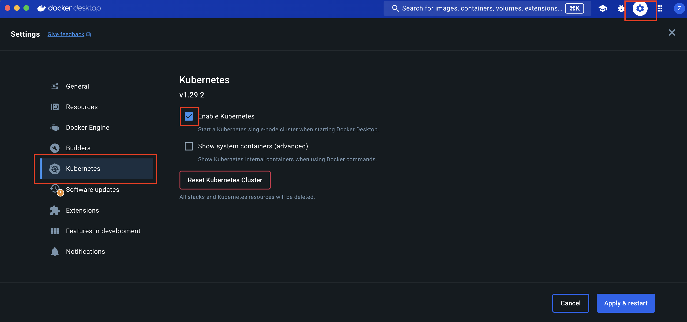

# Part 4: Deploy on Kubernetes

In part 4, you will need to enable Kubernetes in Docker Desktop.

# Step 1: Enable Kubernetes from the Docker Desktop UI

1. Open Docker Desktop, and from the dashboard, select **Settings**. Then select **Kubernetes** from the left sidebar. Next to **enable Kubernetes**, select the checkbox. Select **Apply & Restart** to save the settings and then select Install to confirm. (This may take a while).
    
    
    
2. Enabling Kubernetes from Docker Desktop also enables the **Kubernetes CLI (kubectl)**. However, the executable may not be available in your shell’s PATH variable, so you may need to add it to the PATH.

# Step 2: Create Kubernetes yaml Files

We’ll use Docker Desktop to deploy our application to a Kubernetes environment on our local machines.

1. First, we’ll create a **Kubernetes YAML** file. In your working project directory, create a file named `docker-postgres-kubernetes.yaml`. Open the file in an IDE or text editor and add the following contents. Make sure to replace DOCKER_USERNAME/REPO_NAME with your Docker username
    
    ```yaml
    apiVersion: apps/v1
    kind: Deployment
    metadata:
      name: postgres
      namespace: default
    spec:
      replicas: 1
      selector:
        matchLabels:
          app: postgres
      template:
        metadata:
          labels:
            app: postgres
        spec:
          containers:
            - name: postgres
              image: postgres
              ports:
                - containerPort: 5432
              env:
                - name: POSTGRES_DB
                  value: example
                - name: POSTGRES_USER
                  value: postgres
                - name: POSTGRES_PASSWORD
                  valueFrom:
                    secretKeyRef:
                      name: postgres-secret
                      key: POSTGRES_PASSWORD
              volumeMounts:
                - name: postgres-data
                  mountPath: /var/lib/postgresql/data
          volumes:
            - name: postgres-data
              persistentVolumeClaim:
                claimName: postgres-pvc
    ---
    apiVersion: v1
    kind: Service
    metadata:
      name: postgres
      namespace: default
    spec:
      ports:
        - port: 5432
      selector:
        app: postgres
    ---
    apiVersion: v1
    kind: PersistentVolumeClaim
    metadata:
      name: postgres-pvc
      namespace: default
    spec:
      accessModes:
        - ReadWriteOnce
      resources:
        requests:
          storage: 1Gi
    ---
    apiVersion: v1
    kind: Secret
    metadata:
      name: postgres-secret
      namespace: default
    type: Opaque
    data:
      POSTGRES_PASSWORD: cG9zdGdyZXNfcGFzc3dvcmQ= # Base64 encoded password (e.g., 'postgres_password')
    ```
    
    Note that in the YAML file, there are several objects, separated by  `---`
    
    These objects are: a **Deployment**, a **Service**, a **PersistentVolumeClaim**, and a **Secret**. Inspect these components. Think about how the definitions for each of these components maps to what we’ve learned about Kubernetes so far.
    
2. Now, let’s create a second yaml file in our project directory. Call this one `docker-python-kubernetes.yaml` . Copy and paste the following into the file:
    
    ```yaml
    apiVersion: apps/v1
    kind: Deployment
    metadata:
      name: docker-python-demo
      namespace: default
    spec:
      replicas: 1
      selector:
        matchLabels:
          service: fastapi
      template:
        metadata:
          labels:
            service: fastapi
        spec:
          containers:
            - name: fastapi-service
              image: technox64/python-docker-dev-example-test:latest
              imagePullPolicy: Always
              env:
                - name: POSTGRES_PASSWORD
                  valueFrom:
                    secretKeyRef:
                      name: postgres-secret
                      key: POSTGRES_PASSWORD
                - name: POSTGRES_USER
                  value: postgres
                - name: POSTGRES_DB
                  value: example
                - name: POSTGRES_SERVER
                  value: postgres
                - name: POSTGRES_PORT
                  value: "5432"
              ports:
                - containerPort: 8001
    ---
    apiVersion: v1
    kind: Service
    metadata:
      name: service-entrypoint
      namespace: default
    spec:
      type: NodePort
      selector:
        service: fastapi
      ports:
        - port: 8001
          targetPort: 8001
          nodePort: 30001
    ```
    
    The second part of this file is the **NodePort** service, which will route traffic from port `30001` on the host (your operating system) to port `8001` inside the pods it routes to, allowing you to reach your app from the network. The **NodePort** service is meant for development; for production environments, you should use an **ingress-controller.**
    

## Step 3: Deploy and check your application

1. Open a new terminal, navigate to your working project directory and deploy your application to Kubernetes:
    
    ```bash
    kubectl apply -f docker-postgres-kubernetes.yaml
    ```
    
    You should see output that looks like the following, indicating that your Kubernetes objects were created successfully.
    
    ```bash
    deployment.apps/postgres created
    service/postgres created
    persistentvolumeclaim/postgres-pvc created
    secret/postgres-secret created
    ```
    
    Now deploy your python application:
    
    ```yaml
    kubectl apply -f docker-python-kubernetes.yaml
    ```
    
    You should see output that looks like the following, indicating your Kubernetes objects were created successfully:
    
    ```yaml
    deployment.apps/docker-python-demo created
    service/service-entrypoint created
    ```
    
2. Make sure everything worked by listing your deployments:
    
    ```bash
    kubectl get deployments
    ```
    
    You should see output similar to this:
    
    ```yaml
    NAME                 READY   UP-TO-DATE   AVAILABLE   AGE
    docker-python-demo   1/1     1            1           48s
    postgres             1/1     1            1           2m39s
    ```
    
    This indicates that all of the pods you defined in your YAML files are running. 
    
    Do the same thing for your services
    
    ```bash
    kubectl get services
    ```
    
    You should see output similar to the following:
    
    ```yaml
    NAME                 TYPE        CLUSTER-IP     EXTERNAL-IP   PORT(S)          AGE
    kubernetes           ClusterIP   10.43.0.1      <none>        443/TCP          13h
    postgres             ClusterIP   10.43.209.25   <none>        5432/TCP         3m10s
    service-entrypoint   NodePort    10.43.67.120   <none>        8001:30001/TCP   79s
    ```
    
3. Now we’ll `curl` the service. Note that a database was not deployed in this example:
    
    ```bash
    curl [http://localhost:30001/](http://localhost:30001/)
    ```
    
4. Run the following command to tear down your application:
    
    ```bash
    kubectl delete -f docker-python-kubernetes.yaml
    kubectl delete -f docker-postgres-kubernetes.yaml
    ```
    

# Step 4: Commit your code back to your repository

1. First, you’ll need to pull changes that are in your remote that are not local (remember we added the GitHub Actions yaml file!)
    
    ```bash
    git pull
    ```
    
2. Now proceed with committing your code.
    
    ```bash
    git status
    //shows you the files that have been added or changed
    
    git add {filenames separated by spaces}
    //stages your files to be committed
    
    git commit -m “your commit message here”
    //commit your changes and add a description
    
    git push -u origin main
    //push your code to your repository.
    ```
    
3. Back in your repository, you can go to the Actions tab and watch the GitHub Actions workflow run!

# Step 5: Submit the Lab

To submit this lab in D2L, paste a link to both the Part 1 and Part 2 repositories you created. Your repositories need to be public in order for us to grade it!